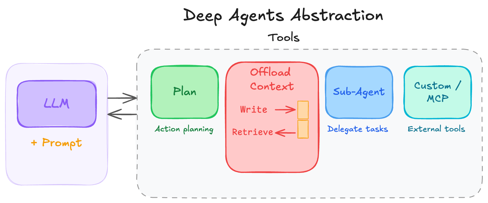

# langgraph-coordinator-agent

A Manus-style multi-domain research agent built with LangGraph. The parent agent plans research tasks using a TODO list and delegates each task to isolated sub-agents. Sub-agents search the web and offload full content to a virtual file system, returning only AI-generated summaries to the parent — keeping the parent's context small while preserving full content for selective retrieval.



## How it differs from my other repos

| Repo                                                                                       | Key Pattern                                                             |
| ------------------------------------------------------------------------------------------ | ----------------------------------------------------------------------- |
| [`langgraph-research-assistant`](https://github.com/pytholic/langgraph-research-assistant) | Multi-persona analysts, HITL checkpoint, map-reduce parallel interviews |
| [`langgraph-task-maistro`](https://github.com/pytholic/langgraph-task-maistro)             | Persistent memory (Postgres), Docker deployment, versioned assistants   |
| **`langgraph-coordinator-agent`** (this repo)                                              | Sub-agent context isolation + virtual FS context offloading             |

## Agentic pattern

> For the reasoning behind choosing LangGraph over a simple LLM tool-calling loop, see [docs/why-langgraph.md](docs/why-langgraph.md).

This agent implements the **Coordinator pattern**: the parent agent uses AI reasoning to dynamically decompose a research question into sub-tasks and dispatches each to a specialized sub-agent. The parent maintains overall context; each sub-agent receives a clean, isolated context window (task description only) and is stateless from the parent's perspective — returning only its final output as a `ToolMessage`.

This differs from hardcoded multi-agent patterns (sequential, parallel) where routing logic is predetermined, and from the Swarm pattern where agents communicate peer-to-peer without a central coordinator.

## Architecture

```
User
  │
  ▼
Parent Agent  ──── TODO list (plans tasks)
  │               Virtual FS (reads files selectively)
  │
  ├─── task("Research X", "research-agent")
  │         │
  │         ▼
  │    Research Sub-Agent  (isolated context: only task description)
  │         │
  │         ├─── tavily_search() → saves full content to DeepAgentState.files
  │         │                      returns ≤150-word summary to messages
  │         └─── think_tool()   → reflection between searches
  │
  └─── task("Research Y", "research-agent")  ← parallel, same pattern
            │
            ▼
       Research Sub-Agent  (isolated context)
            └─── ...
```

## How it works

- **Context isolation**: Sub-agents receive only their task description as `state["messages"]` — no parent conversation history. This prevents context pollution and keeps each sub-agent focused.
- **Content offloading**: `tavily_search` saves raw webpage content to `state["files"]` and returns a short summary to the message thread. The parent reads files only when it needs detail.
- **Additive state**: The `file_reducer` in `state.py` merges file dicts, so parallel sub-agents can each write files without overwriting each other.
- **Flexible parallelism**: The parent can dispatch up to `max_concurrent_research_units` sub-agents per iteration for independent research directions.
- **Selective retrieval**: After delegation completes, the parent synthesizes from summaries and calls `read_file()` only for sources it needs to quote or verify.

See [docs/architecture.md](docs/architecture.md) for a deeper explanation with code snippets.

## Setup

```bash
git clone https://github.com/pytholic/langgraph-coordinator-agent
cd langgraph-coordinator-agent
uv sync
cp .env.example .env
# fill in OPENAI_API_KEY and TAVILY_API_KEY in .env
```

Run the demo notebook:

```bash
uv run jupyter notebook examples/research_demo.ipynb
```

Or import directly:

```python
from deep_research_agent.agent import create_deep_research_agent

agent = create_deep_research_agent()
result = agent.invoke({
    "messages": [{"role": "user", "content": "Give me an overview of Model Context Protocol (MCP)."}]
})
```

## Example output

```
🧑 Human
Give me an overview of Model Context Protocol (MCP).

🔧 Tool Output  [write_todos]
Updated todo list: [{"title": "Research MCP overview", "status": "in_progress"}]

🔧 Tool Output  [task → research-agent]
## Model Context Protocol (MCP)

**MCP** is an open standard introduced by Anthropic in November 2024 that defines
how AI applications connect to external data sources and tools. It uses a
client-server architecture where an MCP host (e.g., Claude Desktop, an IDE)
connects to MCP servers that expose resources, tools, and prompts.

Key points:
- **Standardization**: replaces one-off integrations with a single protocol
- **Transport**: supports stdio (local) and HTTP+SSE (remote) transports
- **Ecosystem**: 1000+ community MCP servers as of early 2025
...

🤖 Assistant
# Model Context Protocol (MCP)

## What is MCP?
MCP is an open protocol that standardizes how AI models connect to external
data sources and tools...
```

## Future work

Will be building more projects on top of this template design.
